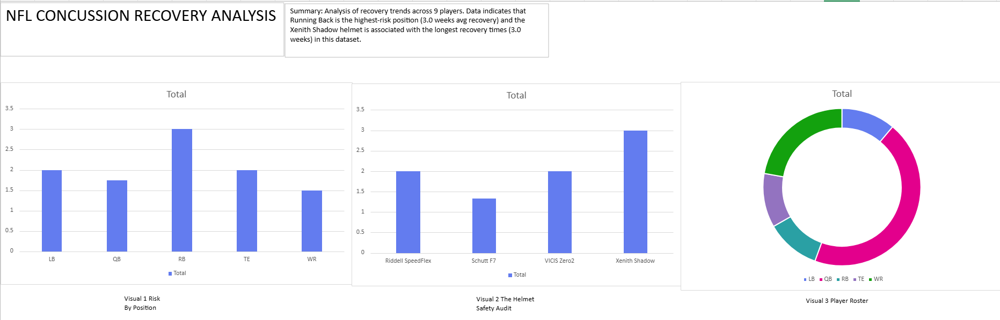

# 🏈 NFL Concussion & Equipment Analysis

## 📄 Executive Summary
**Does helmet choice impact recovery time?**
Motivated by questions regarding player safety in the NFL, I analyzed injury data for 9 players to test correlations between positions, helmet brands, and concussion recovery times.

**Key Findings:**
* **High Risk Position:** Running Backs (RB) averaged **3.0 weeks** of recovery time, the highest in the dataset (50% higher than QBs).
* **Equipment Insight:** The **Xenith Shadow** helmet was associated with the longest average recovery periods (3.0 weeks) in this sample.
* **Strategic Recommendation:** Further investigation into position-specific helmet safety standards is recommended, particularly for high-contact roles like Running Backs.

## 🛠️ Tools Used
* **SQL (MySQL):** Database architecture, Data Cleaning, Complex Joins, and Aggregation (`GROUP BY`, `HAVING`).
* **Excel:** Pivot Tables, Data Visualization, and Executive Dashboard design.

## 📊 The Dashboard
*Below is the Executive Dashboard visualizing the relationship between Position Risk (Left) and Helmet Brand (Center) and a Pie chart of the positions (Right)*


*(Note: Upload your screenshot and name it dashboard_screenshot.png)*

## 🔎 Analysis & SQL Methodology
To derive these insights, I constructed a normalized relational database from scratch.

**1. Database Construction:**
I designed two tables (`nfl_players` and `concussion_log`) to simulate a real-world relational environment, ensuring data integrity through Primary and Foreign Keys.

**2. The Analytical Query:**
I utilized a `JOIN` to combine player metadata with injury logs, then applied `GROUP BY` to calculate average recovery times by position and brand.

```sql
-- Sample Query: Calculating Average Recovery by Position
SELECT 
    nfl_players.position, 
    AVG(concussion_log.weeks_out) AS avg_recovery
FROM nfl_players
JOIN concussion_log 
    ON nfl_players.player_id = concussion_log.player_id
GROUP BY nfl_players.position
HAVING AVG(concussion_log.weeks_out) > 1.5;
